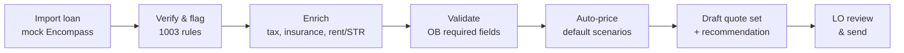
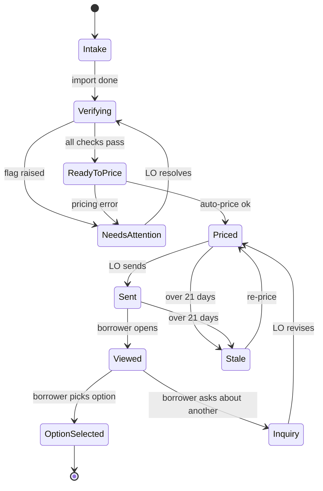
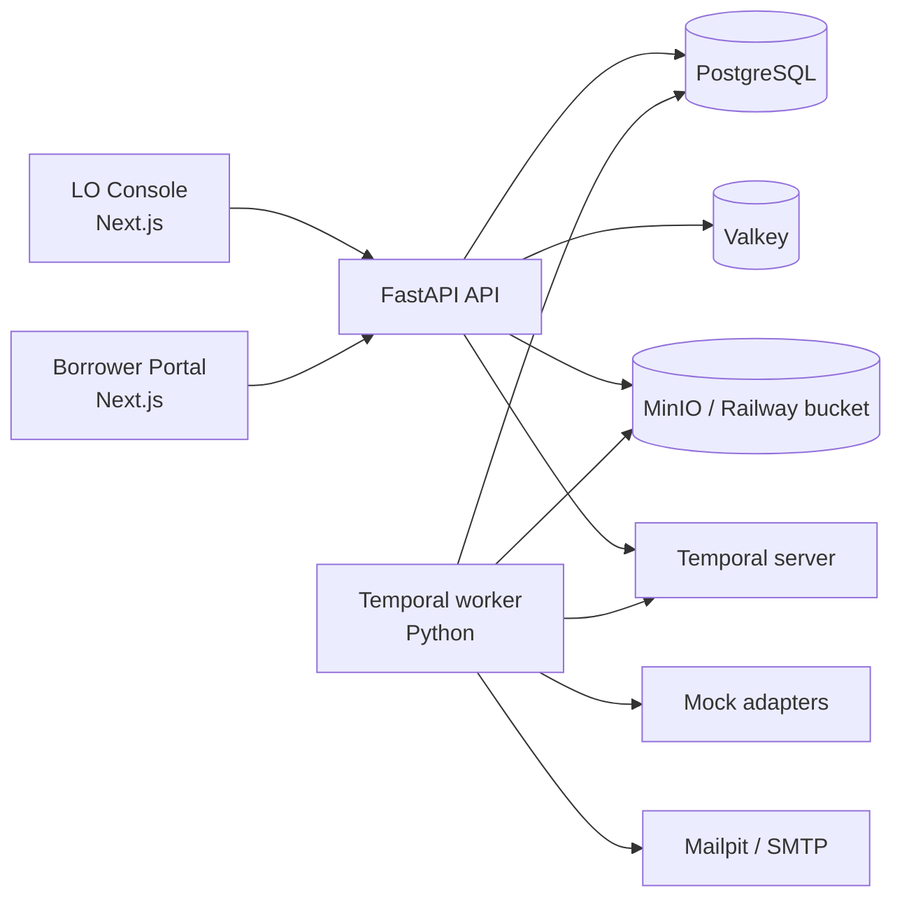

# Clear Quote — System Design & Feature Spec

Source of truth: this file. It mirrors the planning doc agreed on 2026-09-24. Field names come from `docs/design/data-field-catalog.md`. The roadmap and backlog are in `docs/roadmap.md`.

## Goal, principles and scope

Clear Quote is a separate portal that turns an LO's loan file into a priced, explained quote in minutes, and shows the borrower only the numbers that matter. The prototype exists to demonstrate product thinking. It runs entirely on emulated data because Encompass, Optimal Blue, AirDNA and the other providers are commercial APIs.

**Principles**

1. **Automate by default, edit by exception.** The system imports, enriches, validates and prices on its own. The LO confirms or overrides; they never start from a blank form.
2. **Every number shows its source.** Each auto-filled value carries a badge (Encompass, AirDNA, SmartAsset, Default, LO override). Any edited value can be reverted to its source.
3. **One calculation engine.** All money math runs server-side in `Decimal`. The LO preview, borrower report and PDFs render the same numbers.
4. **The strategy gates the UI.** Primary hides rent, DSCR, cashflow, cost seg and PPP. LTR and STR are never shown side by side.
5. **The borrower sees 3–4 numbers first; detail is one click away.**

**Scope tiers**

| Tier | Depth | Features |
| --- | --- | --- |
| A: the demo | Pixel-polished, instant | Application header, Pricing + Quote Builder, Send Quotes with report/letter preview, borrower report (hero numbers, recommendation, options, breakdown, cashflow, tax savings, property matches), pre-approval PDF |
| B: functional | Working, standard design | LO auth + OTP, dashboard, clientele list and detail, applications list, verification tabs (borrower, housing, credit, property) with auto-flags, borrower auth, application status page, "move forward with this option", email outbox, activity timeline |
| C: stubbed | Seeded or minimal | Borrower application wizard (tabs render and save; seed data is the main source), hard-pull consent flow, support contact form, CRM sync, admin settings for defaults |
| Out of scope | Not built | Refinance, FHA, second home, rate locks, Loan Estimate/TRID disclosures, real credit bureaus, real email deliverability hardening |

## Automation-first input model

The LO touches at most five pricing inputs; everything else arrives through the import and enrichment pipeline. When an input is already known (from the application or a prior quote), it is pre-filled and the LO only confirms.

**The only inputs the LO owns**

| Input | Default when not provided | Editable |
| --- | --- | --- |
| Purchase price | Borrower's requested amount from the application; else max purchasing power | Yes |
| Down payment % | Primary 20%, Investment 25% (15/20/25 offered) | Yes |
| Prepayment penalty (investment only) | 5-year | Yes |
| Note rate | Empty until pricing runs; then the par rate (greyed until priced) | Yes, by choosing a priced row |
| Strategy | Imported: Primary, LTR or STR | Yes |

**What runs automatically after import**



The chain runs as one Temporal workflow per application, with one activity per stage. Each stage writes to the activity timeline. The live breakdown preview stays a synchronous API call, outside Temporal. A failing stage stops the chain and moves the application to **Needs Attention** with the exact missing field (for example "Cannot price: missing Occupancy"). When the LO fixes it, the chain resumes from that stage.

**Re-pricing on edit.** Changing any pricing input recomputes the breakdown immediately (debounced, under 300 ms). Changing a value that affects pricing (price, down payment, PPP, FICO, DSCR bucket) marks the quotes stale and offers one-click re-pricing. New-address re-pricing reuses the workspace and targets under 10 seconds.

## Hero numbers

Primary loans show three hero numbers and investment loans show four; purchase price sits in the report header for both. Every hero number is for the currently selected option (the recommended one by default).

| Position | Primary | Investment (LTR or STR) |
| --- | --- | --- |
| Header | Purchase price, address or "TBD", date | Same |
| 1 | Total monthly payment (PITI + MI + HOA) | Total monthly payment (PITIA) |
| 2 | Cash to close | Cash to close |
| 3 | Loan amount and rate (e.g. "$273,600 at 7.500%") | Estimated monthly cashflow, labelled LTR or STR, red when negative |
| 4 | — | Estimated year-1 tax savings (with "≈ $X/mo") |

DSCR is not a hero number; it appears in the "Why the rental income works" card and in the breakdown. The LO console header uses a denser set: purchasing power, down payment (% and $), PPP, note rate, occupancy/strategy, program, location and status.

## Application status machine

One status enum drives both portals, the dashboard counts and the filters.



The borrower's button reads "I'd like to move forward with this option," not "Accept." The rate is not locked and the report is not a Loan Estimate. Withdrawn and Closed exist as terminal states set by the LO.

**Dashboard tiles** map directly to this enum: total clients, total applications, pre-approvals issued (Sent + later), applications with a property attached, awaiting LO review (Priced + Inquiry + OptionSelected), errors (NeedsAttention), and stale quotes.

## LO Console

The console has three menus (Dashboard, Clients, Applications) plus an Outbox and Settings. Roles are LO (sees own files), Manager (sees all, filters by LO) and Admin (defaults, fee constants, users).

**Auth.** Email + password, then a 6-digit email OTP (5-minute expiry, 5 attempts, rate-limited in Valkey). Session in an httpOnly cookie.

**Dashboard.** Status tiles (see the status machine), a "Needs your attention" queue sorted by age, a stale-quotes list, and a recent-activity feed. Each tile links to the Applications list pre-filtered.

**Clients.** Table with search by name/email and filters for assigned LO, created date range and has-active-application. The client detail page shows contact info, applications (same row component as the Applications list), sent quotes and the activity timeline.

**Applications.** Table with filters for client, LO, status, occupancy/strategy, amount range, state and date range. Each row shows a status pill and a flag count.

**Application workspace.** A sticky header with the console header numbers and status, then tabs in order. Each tab shows a green check or a flag count; flags list the field and the rule that failed.

| Tab | What it shows | Automation | LO actions |
| --- | --- | --- | --- |
| 1. Borrowers | Borrower and co-borrower: name, SSN (masked), DOB, marital status, dependents, phones (cell/home/work), emails, vesting, LLC name | Copies cell to home phone; sets "No co-applicant" when none; validates formats | Edit any field; revert to source |
| 2. Housing | Current and prior addresses, own/rent, years/months | Flags when history is under 24 months | Edit; add prior address |
| 3. Credit & liabilities | Representative FICO, bracket, pull type, liabilities table, DTI (primary only) | Soft pull on import; liabilities imported; DTI computed | Request hard pull (sends consent request to borrower); re-import liabilities |
| 4. Assets & income | Verified assets, reserves required, income and employment (primary only), document checklist | Asset sufficiency = assets ≥ cash to close + reserves | Mark documents received; edit |
| 5. Property | Subject address or TBD; county/state/zip prefilled; property type, units; buy-box states and metros | County from zip; "Recommend 3 properties" on by default when TBD | Enter address; toggle recommendations; multi-select buy-box |
| 6. Pricing & Quote Builder | Top: pricing panel. Bottom: quote cards | Enriched tax, insurance, HOA, rent/STR revenue; auto-priced default scenarios | Edit inputs; add/edit/delete quotes; Save & AutoQuote or pick a product manually |
| 7. Send | Quote selection, recommendation, report and letter preview | Pre-selects the recommended quote plus up to 2 alternatives | Reorder, change recommendation, edit the note, preview, send |

**Pricing panel (tab 6, top).** Purchase price, down payment (% ⇄ $ linked), loan amount, LTV, note rate, P&I, taxes (rate + source badge), insurance (default 0.5% of price/yr), MI (primary, LTV > 80%), HOA, total monthly payment. For investment, also market rent (LTR) or STR gross revenue, underwritten rent, DSCR and break-even rent. Each enriched field shows its source and an override marker.

**Quote Builder (tab 6, bottom).** Default scenario sets:

- *Investment:* at assumed DSCR 1.00 → Par and Buydown; at computed DSCR → Par and Buydown. When computed DSCR lands in the same pricing bucket as 1.00, the second group collapses into the first with a note.
- *Primary (Conventional):* at chosen down payment → Par and Buydown; at the next down-payment step that removes MI (or 20%) → Par.

The Add/Edit overlay holds every pricing input. **Save & AutoQuote** picks the best product at par and the best buydown (lowest rate for ≤ 1.00 point). **Choose manually** shows the full mock OB result grid (investor, product, rate, price, points, lock days) to pick from. Cards can be compared side by side.

**Send (tab 7).** Checkboxes on quotes, a "Recommended" radio, and an optional LO note (the "What we recommend" text is pre-drafted from the scenario). The preview renders the exact borrower report and the pre-approval PDF in a side panel. Send blocks when any quote is stale or any required flag is open. Sending generates the PDF, stores it, creates the borrower portal report link, emails the borrower and logs to the timeline and mock CRM. The letter shows the par quote only and points the borrower to the portal report for all options. The assigned LO always signs the letter.

**Outbox.** Every email the system sent, with recipients, body preview and attachments. It makes the demo independent of real email delivery.

## Borrower Portal

The portal is public-facing. Borrowers sign in with email + password, then a 6-digit email OTP (same limits as staff). They create their own account on the portal: when the email matches an existing client the account links to it, otherwise a new client is created. The quote email links to the portal report, which asks the borrower to sign in (or create an account) first. There is no magic link (human decision, 2026-09-25).

**Home.** The current application's status as a progress bar (Applied → In review → Pre-approved → Option selected), the next action for the borrower, and "Start a new application" when none exists.

**Apply (Tier C).** A 4-tab wizard: you (personal info, co-borrower), property & goal, income & assets, consent. Each tab validates before the next unlocks and the draft autosaves. Submitting creates an application in Intake, which triggers the same automation chain as an import.

**Quote report (Tier A).** The borrower view of the four-numbers experience, in this order:

1. Header: "{First name}, here are your numbers", address or "Property to be determined", purchase price, prepared date, rate "as of" date, Save as PDF.
2. Option switcher (one pill per priced option, recommended first). Switching updates the hero numbers and breakdowns.
3. Hero numbers (see Hero numbers).
4. What we recommend: one sentence plus the LO's note.
5. Two explainer cards (investment only): why the rental income works (rent vs payment, DSCR), and year-1 tax savings (with the "estimate only, not tax advice" line).
6. Collapsed: "See all N options we priced" → the scenario comparison table, recommended column highlighted.
7. Collapsed: "See the full breakdown" → quote breakdown, cashflow and cost-seg tables.
8. Property matches (when TBD and recommendations are on): 3 cards run through the same numbers.
9. Actions: "I'd like to move forward with this option" and "Ask about another option" (opens a short note to the LO). Both email the LO and update the status. Non-binding.
10. Disclosures footer: core disclaimer always; investment and tax disclaimers when applicable.

When the quote passes 21 days, the report shows a "These numbers have expired" banner, hides the actions and offers "Ask for updated numbers".

**Hard-pull consent (Tier C).** When the LO requests a hard pull, the borrower gets an email and a portal task to authorize it. The consent text, timestamp and IP are logged before the mock pull runs.

**Support (Tier C).** A contact form (topic, message, preferred contact method) prefilled with the borrower's details. It emails the support inbox and logs to the timeline.

## Calculation engine

One Python module (`quote_engine`) computes every number from a scenario input and a config snapshot. It is pure (no I/O) so it is fast and fully unit-tested. Money uses `Decimal`, rounded half-up to cents only at display. Each quote stores the config snapshot it was computed with, so old quotes never change when defaults do.

**Payment**

```
L     = P × (1 − d)
P&I   = L × r(1+r)^n / ((1+r)^n − 1),   r = rate / 12,   n = 360
PITIA = P&I + (P × t) / 12 + (P × 0.005) / 12 + MI + HOA
```

P is purchase price, d the down payment %, t the annual tax rate. MI applies to primary loans only, when LTV > 80%, from an LTV × FICO factor matrix.

**Cash to close**

```
CTC = D + F_lender + points × L + F_title + prepaids − credits
```

Lender fees are $995 processing + $795 underwriting = $1,790. Title is 0.7% of price. Prepaids are 15 days of per-diem interest + 14 months of insurance + 3 months of taxes (configurable). Negative points are credits. Appraisal (~$600–900) is shown separately as paid before closing.

**Investment**

- Qualifying rent: LTR = 100% of market rent. STR = gross monthly revenue × (1 − 20% expense ratio).
- DSCR = qualifying rent ÷ PITIA, 2 decimals.
- Monthly cashflow = qualifying rent − PITIA.
- Break-even rent (LTR) = PITIA × target DSCR. STR annual target = PITIA × 12 ÷ 0.80.
- Cap rate = qualifying rent × 12 × 75% ÷ price.

**Cost segregation**

```
B = 0.8 P      A = 0.25 B
Ded_1     = A × bonus% + (B − A) / 27.5
Savings_1 = Ded_1 × marginal rate
```

The straight-line term reconciles the reference: $342,000 → $68,400 + $7,462 = $75,862 deduction → $24,276 at 32%. Bonus % and marginal rate are config values.

**DSCR pricing loop.** Price at the assumed DSCR bucket, compute actual DSCR, and re-price once if the bucket differs. At most two passes; if it still flips, keep the lower-DSCR result and flag it.

**Golden tests** (from the reference sheets)

| Case | Input | Expected |
| --- | --- | --- |
| P&I | $225,000 at 7.125%, 30y | $1,515.87 |
| P&I | $273,600 at 7.500%, 30y | $1,913.05 |
| STR rent target | PITIA $1,820.87 | $27,313/yr |
| STR underwritten rent | $3,050 gross | $2,440 |
| DSCR | $2,440 ÷ $2,704.11 | 0.90 |
| Cost seg | $342,000, 100% bonus, 32% | $24,275.78 |
| Cap rate | $2,440 rent, $342,000 | 6.42% |
| Cashflow + tax | −$264.11 + $24,275.78 ÷ 12 | $1,758.87 |

**Reference data to correct in the seed set.** The reference report mixes LTR (+$196) and STR (−$264) cashflow for one property, and its par breakdown lists 0.750% points that its cash to close excludes. Title at 0.7% of $342,000 is $2,394, not $2,100. The seed data must be generated by the engine, never typed in.

## Emulated integrations

Every external system sits behind a Python `Protocol` with a `Mock` implementation. The mocks read from seeded provider tables, so swapping in a real client later touches only the adapter. They add realistic latency (200–1,200 ms) and fail on demand, so the error and retry states are real in the demo.

| Adapter | Mock behaviour | Payload shape |
| --- | --- | --- |
| `LosClient` (Encompass) | Returns a loan file by loan number from seeded LOS records | 1003 field names from the catalog |
| `PricingClient` (Optimal Blue) | Rejects when a required field is missing (named in the error). Otherwise returns 8–15 rows from a rate sheet: base rate by program + adjustments for FICO, LTV, DSCR bucket, PPP, STR, lead source | Catalog's OB request/response JSON |
| `RentClient` (RentCast) | Median LTR rent by zip × beds | Rent, low/high, comps count |
| `StrClient` (AirDNA) | Annual revenue, occupancy, ADR by zip × beds | Revenue, occupancy, ADR, comps count |
| `TaxClient` (SmartAsset/county) | Effective rate by county | Rate, source name, as-of date |
| `InsuranceClient` (Steadily) | 0.5% of price, adjusted by state | Annual premium |
| `CreditClient` | Soft pull (Experian only) or hard pull (3 scores → middle) | Scores, tradelines |
| `PropertySearchClient` | Filters seeded listings at 70–100% of approved price in buy-box metros, ranks LTR by cashflow and STR by DSCR | Listing + deal grade |
| `CrmClient` | Writes to a local `crm_events` table | Contact id, event, payload |

**Demo controls.** An admin-only "Integration panel" lists each adapter with its last call, latency and result. A toggle forces one adapter to fail, so the Needs Attention path can be shown live.

## Architecture

Two Next.js apps share a UI package and one FastAPI backend. PostgreSQL holds state, MinIO holds files, Temporal runs the stage-based application pipeline, and Valkey backs OTP rate limits and short-lived caches.



**Stack decisions**

| Concern | Choice | Why |
| --- | --- | --- |
| Backend | FastAPI, uv, SQLAlchemy 2 (async), Pydantic v2 | As planned |
| Migrations | Alembic at repo root | As planned |
| Jobs | Temporal (Python SDK) worker; Valkey for OTP limits and caching | The pipeline is stage-based; Temporal gives retries, resume-from-failed-stage and a visible run history per application |
| PDF | WeasyPrint for the pre-approval letter; print stylesheet for the borrower report | No headless browser in the backend image |
| Email | Mailpit locally; any SMTP relay when deployed; in-app Outbox always | Demo never depends on delivery |
| API client | Generated from FastAPI's OpenAPI into `packages/api-client` | Types stay in sync |
| UI | `packages/ui`: design tokens + report components used by both apps | One renderer for LO preview and borrower report |
| Infra | Railway config-as-code + CLI; Docker Compose locally | Terraform/Pulumi is overhead at this size |

**Repo layout** (feature-first; each sub-feature owns its routes, models, schemas, service and tests)

```
clear-quote/
  alembic/
  backend/app/
    core/            config, db, auth deps, errors
    integrations/    los/ pricing/ rent/ str/ tax/ insurance/ credit/ property_search/ crm/
    features/
      auth/          otp/ sessions/
      clients/
      applications/  verification/ housing/ credit/ assets/ property/ timeline/
      pricing/       engine/ enrichment/ scenarios/
      quotes/        builder/ send/ report/ pdf/
      borrower/      portal/ consent/ support/
      notifications/ email/ outbox/
    workflows/       Temporal workflows + activities, worker entrypoint
  apps/lo-console/src/features/...
  apps/borrower-portal/src/features/...
  packages/ui/  packages/api-client/
  seed/          generators + persona fixtures
  infra/         railway + compose
  docs/          design/, roadmap.md, backlog/
```

Each backend sub-feature holds `router.py`, `models.py`, `schemas.py`, `service.py`, `endpoints/` and `tests/`.

## Data model

The core is Client → Application → Scenario → Quote, with every enriched value stored alongside its source. Field names follow the data-field catalog; CQ-007 trims the catalog to what these tables need.

| Table | Key fields | Notes |
| --- | --- | --- |
| `users` | email, role (LO/Manager/Admin), nmls, title, phone | LO profile feeds the letter signature |
| `clients` | name, email, phone, assigned_lo_id, crm_contact_id | Borrower identity, one per person |
| `borrower_accounts` | client_id, email, last_login | Portal login |
| `applications` | client_id, lo_id, los_loan_guid, status, occupancy, strategy, program, purpose (Purchase only), requested price, location | Header numbers are derived, not stored |
| `application_parties` | application_id, role (borrower/co-borrower), 1003 profile fields | SSN encrypted at rest |
| `housing_history`, `employment`, `liabilities`, `assets`, `documents` | application_id + catalog fields | Documents point to object-storage keys |
| `properties` | application_id, address or TBD, county, type, units, buy_box_states[], buy_box_metros[], recommend_matches | |
| `field_values` | application_id, field_key, value, source, source_ref, overridden_by, overridden_at | Powers source badges and "revert to source" |
| `flags` | application_id, tab, field_key, rule, severity, resolved_at | Verification output |
| `scenarios` | application_id, inputs (JSONB), config_snapshot (JSONB), dscr_bucket | One per Add/Edit |
| `quotes` | scenario_id, investor, product, rate, points, lock_days, computed (JSONB), label (Par/Buydown/…), priced_at | `computed` = full engine output |
| `quote_packages` | application_id, quote_ids[], recommended_quote_id, lo_note, letter_key, report_token (opaque id in the report URL; not a credential), sent_at, expires_at, viewed_at, borrower_action | What the borrower sees |
| `consents` | application_id, type, text_hash, ip, at | Hard-pull authorization |
| `activity_events` | application_id, actor, type, payload, at | Timeline + CRM log |
| `outbox_emails` | to, subject, html, attachment_keys[], status | Demo outbox |
| `provider_*` | seeded mock data: rate sheet, rents, STR revenue, tax rates, listings | Read by mock adapters |
| `settings` | fee constants, defaults, expense ratios, tax config | Snapshotted into each scenario |

## Seed data personas

Ten hand-designed personas cover every branch of the product; a generator adds about 200 background applications so lists and the dashboard look lived-in. All numbers come from running the engine over the seeded inputs.

| # | Persona | Scenario | What it demonstrates |
| --- | --- | --- | --- |
| 1 | Marcus Hale | STR, Tampa FL, $342k, 20% down, DSCR < 1 | Negative cashflow shown honestly; tax savings; DSCR re-price loop |
| 2 | Kathleen McReynolds | LTR, TBD property, $300k, 25% down, 5y PPP | Property matches; TBD letter; par vs buydown |
| 3 | Priya Nair | Primary, Carmel IN, $420k, 20% down | 3 hero numbers; investment blocks hidden |
| 4 | Daniel Ortiz | Primary, Indianapolis, $285k, 5% down, FICO 700 | MI from the matrix; DTI shown |
| 5 | Asheville Holdings LLC (Sam Reed) | STR, Asheville NC, $525k, LLC vesting | Entity on the letter; high STR revenue, DSCR > 1.25 bucket |
| 6 | Tom & Lisa Brandt | LTR, Cleveland OH, co-borrowers | Co-borrower tab; combined credit |
| 7 | Aisha Coleman | LTR, missing occupancy in LOS | "Cannot price: missing Occupancy" then fix and resume |
| 8 | Ben Ford | Primary, 14 months at current address | Housing-history flag |
| 9 | Grace Kim | LTR, quote sent 25 days ago | Stale banner; forced re-price |
| 10 | Luis Romero | STR, borrower selected an option | OptionSelected status; timeline; outbox entries |

Each persona has a seeded LOS record, provider rows for its market, and uploaded sample documents (watermarked "SAMPLE").

## Decisions log

| # | Decision |
| --- | --- |
| 1 | Primary loans are Conventional only; no FHA |
| 2 | Occupancy is Primary, LTR or STR; no second home |
| 3 | Borrower can switch between priced options on the report; hero numbers follow |
| 4 | The assigned LO always signs the letter |
| 5 | "Move forward with this option" is non-binding: emails the LO, sets Option Selected |
| 6 | Borrower application wizard has 4 tabs: you, property & goal, income & assets, consent |
| 7 | Temporal runs the application pipeline; Valkey handles OTP limits and caching |
| 8 | Letter PDF via WeasyPrint; borrower report uses a print stylesheet |
| 9 | Staff: password + email OTP. Borrowers: self sign-up, then password + email OTP (magic link dropped, 2026-09-25). No external auth provider |
| 10 | Backlog lives in the repo (`docs/backlog/`) and is mirrored in Kaneo project "Clear Quote TQL" |
| 11 | Each backlog item carries its spec, plan, handoff notes and post-development notes |
| 12 | `make demo-reset` rebuilds the database and seed; Mailpit captures email locally |
| 13 | Primary loans show 3 hero numbers (payment, cash to close, loan amount + rate); investment shows 4 |
| 14 | LO can edit all imported data; every edit keeps its source for revert |
