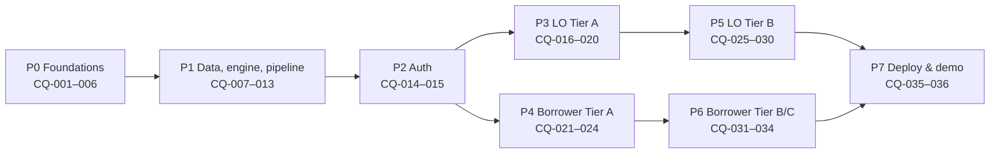

# Clear Quote TQL — Roadmap

Eight phases, 36 backlog items. The repo is the source of truth; Kaneo project **Clear Quote TQL** mirrors status. Per-item detail lives in `docs/backlog/`; the working rules for agents are in `AGENTS.md`. Kaneo task numbers equal the backlog ids.

## Phases

After P2, the LO lane (P3, P5) and the borrower lane (P4, P6) can run in parallel with separate agents.

| Phase | Goal | Milestone you can test locally |
| --- | --- | --- |
| P0 Foundations | Agents configured, repo and local stack running | `make up` starts every service; both apps show a placeholder page calling the API |
| P1 Data, engine, pipeline | Numbers and automation work headless | `make demo-reset` loads personas; each persona's pipeline completes or stops at its expected flag |
| P2 Auth | Staff and borrower login | Log in as an LO and as a borrower |
| P3 LO Tier A | Pricing, quote builder, send | Marcus Hale: import to sent quote with no typing |
| P4 Borrower Tier A | The four-numbers report | Open the emailed link, switch options, move forward |
| P5 LO Tier B | Console around the workspace | Dashboard counts match seed; resolve Aisha's missing-occupancy flag |
| P6 Borrower Tier B/C | Portal around the report | New borrower application flows to Intake and auto-prices |
| P7 Deploy & demo | Public URLs and a clean demo | 5-minute demo script runs end to end on Railway |

## Suggested execution waves

Items in the same wave have no dependency on each other and can run in parallel sessions.

| Wave | Items |
| --- | --- |
| 1 | CQ-001 |
| 2 | CQ-002 |
| 3 | CQ-003, CQ-005 |
| 4 | CQ-004 |
| 5 | CQ-006, CQ-007, CQ-008 |
| 6 | CQ-009, CQ-012, CQ-014, CQ-021 |
| 7 | CQ-010, CQ-013, CQ-015 |
| 8 | CQ-011, CQ-022, CQ-031 |
| 9 | CQ-016, CQ-023, CQ-024, CQ-030, CQ-032, CQ-034 |
| 10 | CQ-017, CQ-025, CQ-026, CQ-027, CQ-028, CQ-029 |
| 11 | CQ-018, CQ-033 |
| 12 | CQ-019 |
| 13 | CQ-020 |
| 14 | CQ-035 |
| 15 | CQ-036 |

## Backlog

| ID | Item | Phase | Depends on | Exit check |
| --- | --- | --- | --- | --- |
| [CQ-001](backlog/CQ-001-agent-tooling/spec.md) | Agent tooling & process | P0 | — | In a fresh session of each agent: superpowers skills listed, a codegraph query answers, `graphify query` returns results, the agent can read and move a Kaneo task. |
| [CQ-002](backlog/CQ-002-monorepo-scaffold/spec.md) | Monorepo scaffold | P0 | CQ-001 | `make lint` and `make test` pass on the empty projects. |
| [CQ-003](backlog/CQ-003-local-infra/spec.md) | Local infrastructure | P0 | CQ-002 | All services healthy; Temporal UI and Mailpit reachable in the browser. |
| [CQ-004](backlog/CQ-004-backend-skeleton/spec.md) | Backend skeleton | P0 | CQ-003 | /health reports DB, Valkey, MinIO and Temporal status; test suite runs against a test DB. |
| [CQ-005](backlog/CQ-005-frontend-skeleton/spec.md) | Frontend skeleton & design system | P0 | CQ-002 | A component gallery page renders in both apps; react-doctor passes. |
| [CQ-006](backlog/CQ-006-ci/spec.md) | CI | P0 | CQ-004, CQ-005 | CI is green on main. |
| [CQ-007](backlog/CQ-007-data-model/spec.md) | Data model & migrations | P1 | CQ-004 | `alembic upgrade head` succeeds on a clean DB; model tests pass. |
| [CQ-008](backlog/CQ-008-quote-engine/spec.md) | Quote engine | P1 | CQ-004 | All golden tests from the spec pass to the cent. |
| [CQ-009](backlog/CQ-009-mock-integrations/spec.md) | Mock integrations | P1 | CQ-007 | Contract tests per adapter; a forced failure returns a named error. |
| [CQ-010](backlog/CQ-010-seed-data/spec.md) | Seed data & demo reset | P1 | CQ-008, CQ-009 | Reset completes in under 60 s; every persona number is produced by the engine. |
| [CQ-011](backlog/CQ-011-temporal-pipeline/spec.md) | Temporal pipeline | P1 | CQ-009, CQ-012, CQ-013 | Each persona ends in its expected status. |
| [CQ-012](backlog/CQ-012-verification-rules/spec.md) | Verification rules | P1 | CQ-007 | Rule tests pass; personas 7 and 8 raise their flags. |
| [CQ-013](backlog/CQ-013-pricing-service/spec.md) | Pricing service & API | P1 | CQ-008, CQ-009 | API tests pass; /quotes/preview responds in under 300 ms. |
| [CQ-014](backlog/CQ-014-staff-auth/spec.md) | Staff auth | P2 | CQ-004, CQ-007 | Auth tests pass; OTP email arrives in Mailpit. |
| [CQ-015](backlog/CQ-015-borrower-auth/spec.md) | Borrower auth | P2 | CQ-014 | A borrower signs up with a seeded client's email, verifies the OTP from Mailpit and is signed in as that client. |
| [CQ-016](backlog/CQ-016-application-workspace/spec.md) | Application workspace shell | P3 | CQ-014, CQ-011 | Header matches engine output for all personas. |
| [CQ-017](backlog/CQ-017-pricing-panel/spec.md) | Pricing panel | P3 | CQ-016, CQ-013 | Editing price updates the breakdown instantly; revert restores the source value. |
| [CQ-018](backlog/CQ-018-quote-builder/spec.md) | Quote builder | P3 | CQ-017 | Marcus Hale gets 4 quotes; a manual pick replaces one. |
| [CQ-019](backlog/CQ-019-send-tab/spec.md) | Send tab & preview | P3 | CQ-018, CQ-021 | The preview equals the borrower view for the same package. |
| [CQ-020](backlog/CQ-020-letter-and-send/spec.md) | Letter PDF & send workflow | P3 | CQ-019, CQ-015 | Email with PDF arrives in Mailpit; status and timeline update. |
| [CQ-021](backlog/CQ-021-report-components/spec.md) | Shared report components | P4 | CQ-005, CQ-008 | All components render in the gallery with persona fixtures. |
| [CQ-022](backlog/CQ-022-borrower-report/spec.md) | Borrower report page | P4 | CQ-021, CQ-015 | Print to PDF is clean; the expired persona shows the banner. |
| [CQ-023](backlog/CQ-023-property-matches/spec.md) | Property matches | P4 | CQ-022, CQ-013 | Kathleen sees 3 matches; Priya sees none. |
| [CQ-024](backlog/CQ-024-borrower-actions/spec.md) | Borrower actions | P4 | CQ-022 | The Option Selected flow works on a fresh persona. |
| [CQ-025](backlog/CQ-025-dashboard/spec.md) | Dashboard | P5 | CQ-016 | Tile counts match seed queries. |
| [CQ-026](backlog/CQ-026-clients/spec.md) | Clients | P5 | CQ-016 | Filters return the expected seed rows. |
| [CQ-027](backlog/CQ-027-applications-list/spec.md) | Applications list | P5 | CQ-016 | Filters return the expected seed rows. |
| [CQ-028](backlog/CQ-028-verification-tabs/spec.md) | Verification tabs | P5 | CQ-016, CQ-012 | Resolving a flag resumes the pipeline. |
| [CQ-029](backlog/CQ-029-timeline-outbox-panel/spec.md) | Timeline, Outbox, Integration panel | P5 | CQ-016, CQ-009 | Forcing a pricing failure shows Needs Attention live. |
| [CQ-030](backlog/CQ-030-stale-quote-job/spec.md) | Stale quote job | P5 | CQ-011 | Grace Kim's quote flips to Stale. |
| [CQ-031](backlog/CQ-031-borrower-home/spec.md) | Borrower home & status | P6 | CQ-015 | Each persona sees its correct stage. |
| [CQ-032](backlog/CQ-032-apply-wizard/spec.md) | Apply wizard | P6 | CQ-031, CQ-011 | A new application auto-prices end to end. |
| [CQ-033](backlog/CQ-033-hard-pull-consent/spec.md) | Hard-pull consent | P6 | CQ-031, CQ-028 | The pull runs only after consent is recorded. |
| [CQ-034](backlog/CQ-034-support-form/spec.md) | Support form | P6 | CQ-031 | Email with borrower details arrives in Mailpit. |
| [CQ-035](backlog/CQ-035-railway-deploy/spec.md) | Railway deployment | P7 | CQ-020, CQ-024, CQ-025, CQ-026, CQ-027, CQ-028, CQ-029, CQ-030, CQ-032, CQ-033, CQ-034 | Public URLs work with the seeded demo. |
| [CQ-036](backlog/CQ-036-e2e-demo/spec.md) | E2E & demo script | P7 | CQ-035 | E2E is green against Railway. |

## Tooling decisions

| # | Decision |
| --- | --- |
| G1 | codegraph answers code questions; graphify answers docs/spec questions; graphify non-strict only |
| G2 | With a CQ spec present, brainstorming is a gap check only; the plan goes to the item's `plan.md` |
| G3 | Superpowers project-scoped where supported; otherwise a documented one-time user install |
| G4 | Kaneo runs locally at `http://localhost:5183`; the MCP (`@kaneo/mcp serve`) is committed for all three agents, no API key |
| G5 | Railway Temporal template with its own Postgres; fallback is a single-container dev server |
